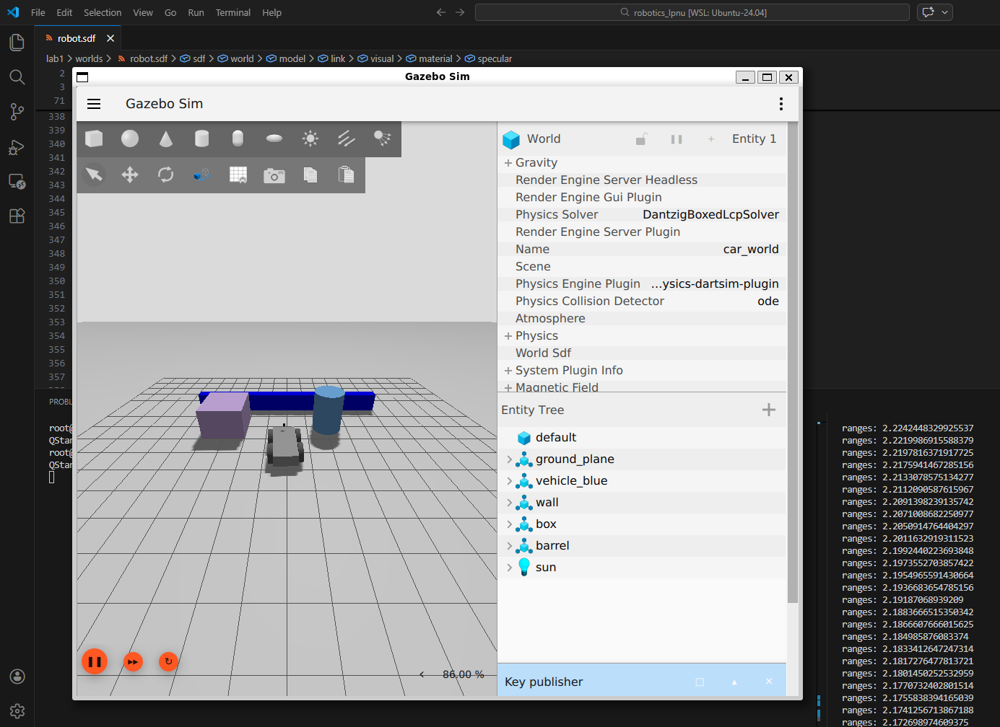

# Lab 1: Building Your Robot in Gazebo

## Description

A simple SDF world file that contains:
- 4-wheel differential drive robot that has:
    - IMU sensor
    - LiDAR sensor
    - KeyPublisher plugin support (for controlling the robot with arrow keys)
- Three types of obstacles with contact sensors:
    - Wall
    - Barrel
    - Box

## Screenshot from Simulation



## Testing Your Robot

```bash
# Enter Docker container
./scripts/cmd bash

# Launch Gazebo with your robot world
gz sim /opt/ws/src/code/lab1/worlds/robot.sdf

# In another terminal, list topics
gz topic -l

# Look at the lidar messages on the /lidar topic, specifically the ranges data
gz topic -e -t /lidar

# Send movement command (example)
gz topic -t "/cmd_vel" -m gz.msgs.Twist -p "linear: {x: 0.5}, angular: {z: 0.2}"
```