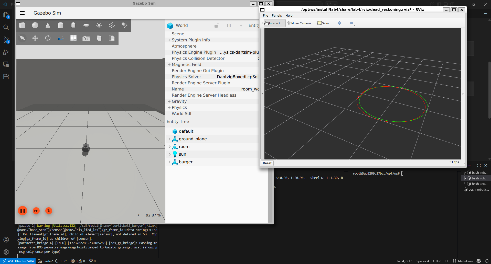

# Lab 4: Dead Reckoning

## Description
Python package that integrates velocity commands (from `/cmd_vel` topic) to estimate robot's pose (dead reckoning).

## Setup

```bash
cd /opt/ws
colcon build --packages-select lab3 lab4
source install/setup.bash
```

## Testing the package

### 1. Launch TurtleBot3

**Terminal 1:**
```bash
ros2 launch lab4 dead_reckoning_bringup.launch.py
```

### 2. Run circle trajectory

**Terminal 2:**
```bash
ros2 run lab3 circle_path
```

### 3. Observe

RViz shows two paths: odom (ground truth) and dead reckoning:

