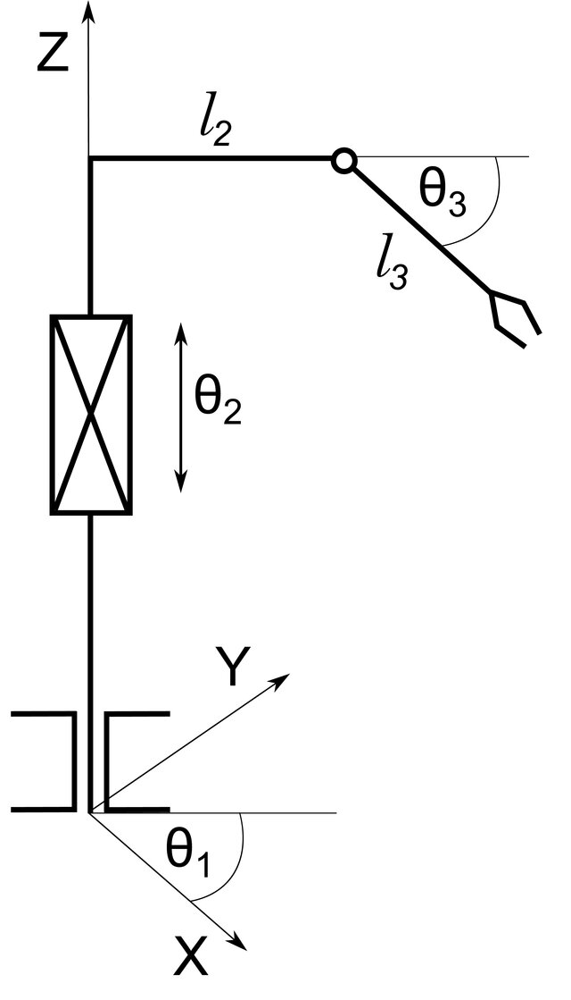

# Laboratory 7 — Coordinate transforms (TF2), robot description (URDF/Xacro), and the RTR manipulator

**Course:** Robotics (ROS 2)  
**Topic:** Spatial transforms, kinematic modeling, and joint-driven TF in ROS 2.

---

## 1. Purpose and learning outcomes

After completing this laboratory, you should be able to:

- Explain how **tf2** represents a tree of coordinate frames and how **broadcasters** and **listeners** use it.
- Build a minimal **Python** node that publishes a dynamic transform and another that **queries** transforms via a buffer.
- Describe a manipulator using **URDF** and parameterised **Xacro**, and visualise it with **robot_state_publisher** and **RViz2**.
- Relate **joint states** on `/joint_states` to link transforms, including the role of **joint_state_broadcaster** in a **ROS 2 Control** stack.
- Apply the **forward kinematics** of the **RTR** (Revolute–Translational–Revolute) manipulator defined below.

---

## 2. Prerequisites

- Laboratory environment: **Ubuntu 24.04** and the **course Docker image** (ROS 2 **Jazzy**), as described in the repository root `README.md`.
- Completed or concurrent study of basic ROS 2 nodes, topics, and launch files.
- Mathematics: vectors, rotation in 3D, trigonometry.

---

## 3. Theoretical background

- [TF2](https://docs.ros.org/en/jazzy/Tutorials/Intermediate/Tf2/Tf2-Main.html) (transform library) 
- [URDF](https://docs.ros.org/en/jazzy/Tutorials/Intermediate/URDF/URDF-Main.html) and Xacro

### 3.1 RTR manipulator and kinematics

The **RTR** (Revolute–Translational–Revolute) manipulator is a three-degree-of-freedom serial chain: base rotation about a vertical axis, translation along that axis, and a revolute elbow in a vertical plane. The photograph below illustrates a representative configuration; the simplified schematic under it matches the joint ordering used in the provided URDF.



**Joint variables** (notation used in this laboratory):

| Symbol | Type | Role in the provided URDF |
|--------|------|---------------------------|
| $\theta_1$ | Revolute | Base yaw about the vertical axis |
| $\theta_2$ | Prismatic | Vertical translation |
| $\theta_3$ | Revolute | Elbow in the vertical plane |

**Link lengths** (default parameters in the package): $l_2 = 0.9\,\mathrm{m}$, $l_3 = 1.0\,\mathrm{m}$.

**Forward kinematics** — end-effector position $\mathbf{p} = (x,y,z)^T$ in the base frame:

$$ \mathbf{p} =
\begin{pmatrix}
\cos\theta_1\,(l_3\cos\theta_3 + l_2) \\
\sin\theta_1\,(l_3\cos\theta_3 + l_2) \\
l_3\sin\theta_3 + \theta_2
\end{pmatrix}.$$

Python helpers for $\mathbf{p}$, the orientation quaternion, the combined pose ``rtr_end_effector_transform`` (used by the TF2 demos), and TF-vs-analytic checks live in `lab7/rtr_kinematics.py`.

---

## 4. Software and package contents

Work in the **container** workspace `/opt/ws` with sources under `/opt/ws/src/code`.

| Path | Description |
|------|-------------|
| `lab7/tf2_demo_cli.py` | Parses `theta_1 theta_2 theta_3 [l2] [l3]` for the TF2 demos |
| `lab7/tf2_broadcaster_demo.py` | **Dynamic** broadcaster: fixed pose from CLI (`world` → `rtr_ee_demo`) |
| `lab7/tf2_listener_demo.py` | Same CLI; recomputes analytic pose and checks TF vs theory |
| `lab7/rtr_kinematics.py` | Forward kinematics, ``rtr_end_effector_transform``, TF pose matching |
| `urdf/rtr_manipulator.xacro` | RTR model and `ros2_control` mock hardware block |
| `launch/rtr_visualize.launch.py` | `joint_state_publisher_gui`, `robot_state_publisher`, RViz2 |
| `launch/rtr_ros2_control.launch.py` | `ros2_control_node`, **joint_state_broadcaster**, **forward_position_controller** |
| `config/rtr_controllers.yaml` | Controller manager and forward-command parameters |
| `tests/test_rtr_kinematics.py` | Kinematics unit tests (no ROS graph) |
| `tests/test_tf2_analytic_agreement.py` | Stepwise pose vs `forward_position` / TF matcher (no ROS graph) |

---

## 5. Procedure

### 5.1 Build the package

```bash
cd /opt/ws
source /opt/ros/jazzy/setup.bash
colcon build --packages-select lab7 --symlink-install
source install/setup.bash
```

If `docker/Dockerfile` was updated on the repository, rebuild the image on the host and start a new container:

```bash
./scripts/cmd build-docker
./scripts/cmd run
```

### 5.2 Part A — TF2 broadcaster and listener

Arguments: **`theta_1 theta_2 theta_3`** (rad, rad, rad), optional **`l2`** **`l3`** (m, default `0.9` `1.0`). Here `theta_2` is the prismatic coordinate in metres, matching the laboratory RTR model.

**Terminal 1 — broadcaster**

```bash
ros2 run lab7 tf2_broadcaster_demo -- 0.2 0.5 0.35
```

**Terminal 2 — listener** (use the **same** numbers so the analytic check succeeds)

```bash
ros2 run lab7 tf2_listener_demo -- 0.2 0.5 0.35
```

**Optional verification**

```bash
ros2 run tf2_ros tf2_echo world rtr_ee_demo
```

**Assignment (Part A).**

1. Familiarize with code structure [rtr_kinematics.py](lab7/rtr_kinematics), [tf2_broadcaster_demo](lab7/tf2_broadcaster_demo.py) and [tf2_listener_demo](lab7/tf2_listener_demo.py).
2. Play with scripts command line parameters, and check on the paper if results mach.

### 5.3 Part B — URDF/Xacro, joint GUI, and TF

```bash
ros2 launch lab7 rtr_visualize.launch.py
```

In **RViz2**, set **Fixed Frame** to `world` if needed and enable **TF**.

**Assignment (Part B).**

1. Compare the **tool0** frame to the analytic $\mathbf{p}$ for the same $(\theta_1,\theta_2,\theta_3)$.
2. Extend or refine the Xacro model (visuals, $l_2$, $l_3$), add at least basic **collision** geometry.

### 5.4 Part C — `joint_state_broadcaster` and TF queries

```bash
ros2 launch lab7 rtr_ros2_control.launch.py
```

Send a position command (revolute joints in **radians**, prismatic **joint_theta2** in **metres**):

```bash
ros2 topic pub --once /forward_position_controller/commands std_msgs/msg/Float64MultiArray \
  "{data: [0.2, 0.6, 0.4]}"
```

Example TF query:

```bash
ros2 run tf2_ros tf2_echo base_link tool0
```

**Warning.** Do not run `rtr_visualize.launch.py` and `rtr_ros2_control.launch.py` **simultaneously**; both would publish conflicting data on `/joint_states`.

**Assignment (Part C).**

1. In the laboratory report, explain how **joint_state_broadcaster** connects the hardware (here: **mock**) interface to `/joint_states` and thus to **robot_state_publisher**. 
2. Provide evidence (screenshots, logs, or a short script) showing commanded joints and consistent TF and `/joint_states`.

### 5.5 Automated check (kinematics)

```bash
colcon test --packages-select lab7
```

The suite checks forward kinematics, ``rtr_end_effector_transform`` (shared by the TF demos), and the TF-vs-analytic matcher the listener uses (without starting a ROS graph).

All tests must pass before submission unless the instructor specifies otherwise.

---

## 6. Report and submission

Submit according to the **course regulations** (deadline, format, plagiarism policy). The report should include:

1. **Title page** — course name, laboratory number, your name and group, date.
2. **Objective** — short restatement of the learning outcomes (§1).
3. **Theory** — TF2, URDF/Xacro, and the RTR equations in §3.3.
4. **Procedure and results** — Parts A–C: what you ran, what you changed, key figures (RViz, terminal output).
5. **Discussion** — Agreement between TF (or measured joint angles) and analytic $\mathbf{p}$ for **at least two** configurations, limitations of the model.
6. **Conclusion** — a few sentences on what you learned.

**Required artefacts (code)**

- Your **URDF/Xacro** (diff or full files as instructed).
- Confirmation that **pytest** passes on the submitted revision.

---

## 7. Bibliography

1. Open Robotics. *ROS 2 Jazzy documentation.* [https://docs.ros.org/en/jazzy/](https://docs.ros.org/en/jazzy/)

---

## 8. Supplementary resources (optional reading)

These external tutorials are **not** part of the formal course materials; they may help if you want step-by-step examples aligned with this laboratory:

- ROS-Industrial training — **TF2**: [ROS2-TF2](https://ros-industrial.github.io/ros2_i_training/_source/navigation/ROS2-TF2.html)
- ROS-Industrial training — **URDF introduction**: [URDF](https://ros-industrial.github.io/ros2_i_training/_source/urdf/introduction.html)
- ROS-Industrial training — **Cartesian robot** (URDF, launch, RViz): [Cartesian robot tutorial](https://ros-industrial.github.io/ros2_i_training/_source/urdf/cartesian_tutorial.html)
